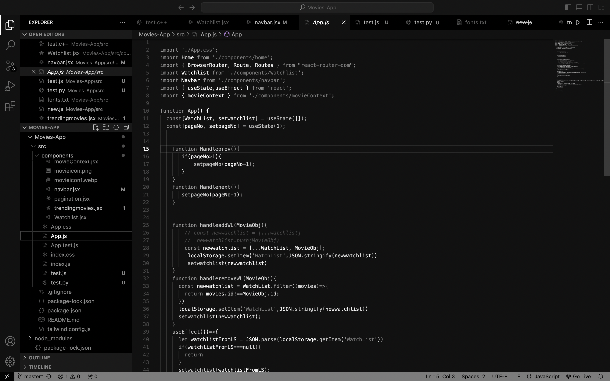
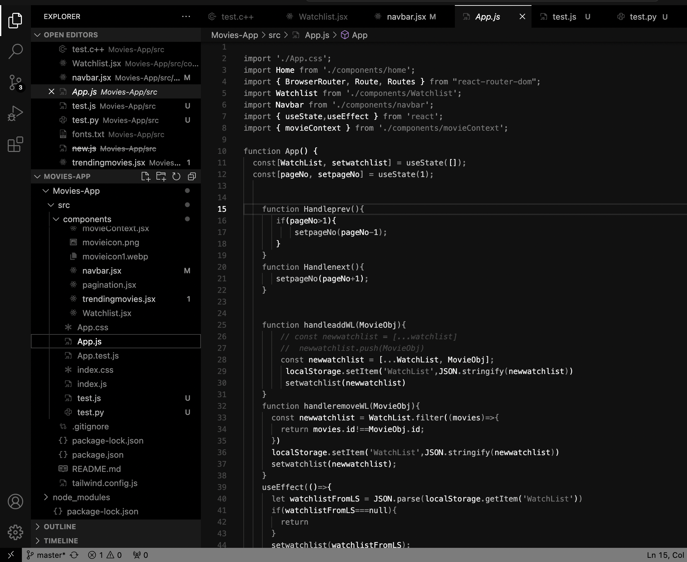
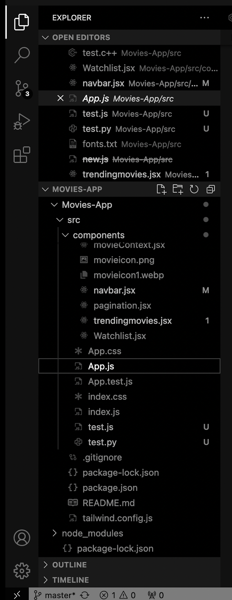
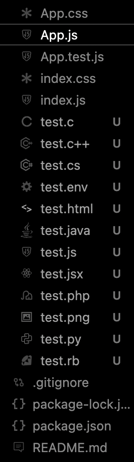

# <h1 align="center">IceAge for visual studio </h1>

This theme is designed using only different shades of white. The shades have been carefully selected for various editor tokens (functions, storage/data types, variables, bracket levels, etc.), as well as buttons, windows, icons, and selectors etc. ensuring they are distinguishable in a manner similar to color-based contrasts.

### The IceAge Theme

##
While the primary aim is to experiment with visual creativity, the theme is highly usable, offering sufficient tokens contrast comparable to any other VScode color-themes contrast. However, due to the high contrast between the background and foreground for aesthetic purposes, it may cause slight eye strain. I would like to create an alternative version in the future that strikes a better balance between comfort and visual appeal.

## IceAge Icons

  
  

To achieve a clean, monotone look, please remember to set the IceAge icon theme alongside the IceAge color theme, or alternatively, disable icons entirely. Since the color theme and icons are separate settings in VS Code, they have been designed and packaged individually

## Installation Guide for IceAge Theme & Icons

Follow the steps below to install and configure the **IceAge** color theme and icon pack in Visual Studio Code.

### Step 1: Install the IceAge Extension

1. Open Visual Studio Code.
2. Go to the **Extensions** view by clicking on the Extensions icon in the Activity Bar on the side of the window or by pressing 'Ctrl+Shift+X'.
3. In the Extensions view, search for **IceAge Theme**.
4. Click **Install**.

### Step 2: Set the IceAge Color Theme

1. Once the installation is complete, go to the **Command Palette** by pressing 'Ctrl+Shift+P'.
2. Type 'Preferences: Color Theme' and press 'Enter'.
3. In the theme selection dropdown, find and select **IceAge**.
   
   Your editor will now be updated with the **IceAge** color scheme.

### Step 3: Set the IceAge Icon Theme (Optional)

1. Open the **Command Palette** again by pressing 'Ctrl+Shift+P'.
2. Type 'Preferences: File Icon Theme' and press 'Enter'.
3. In the icon theme selection dropdown, find and select **IceAge Icons**.
   
   Your file explorer will now display the IceAge icon set.

### Step 4: (Optional) Disable Icons for a Minimalist Look

If you prefer a clean, minimalist design without icons, follow these steps:

1. Open the **Command Palette** ('Ctrl+Shift+P').
2. Type 'Preferences: File Icon Theme' and select **None**.
   
   This will disable the icons and give you a clean, monotone look in your editor.

---

Now you're all set with the IceAge color theme and (optionally) the IceAge icon set. Enjoy the clean, minimalist look of your Visual Studio Code environment!

